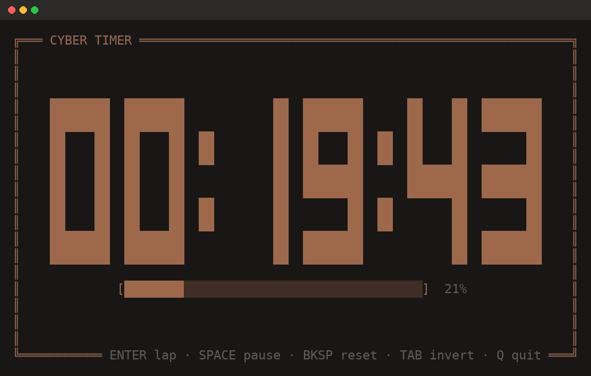
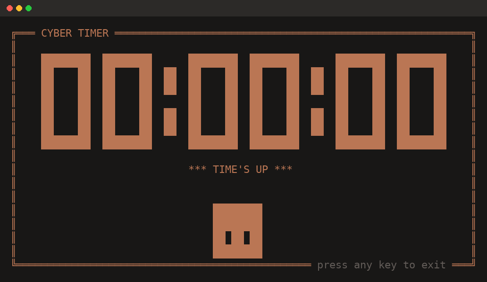
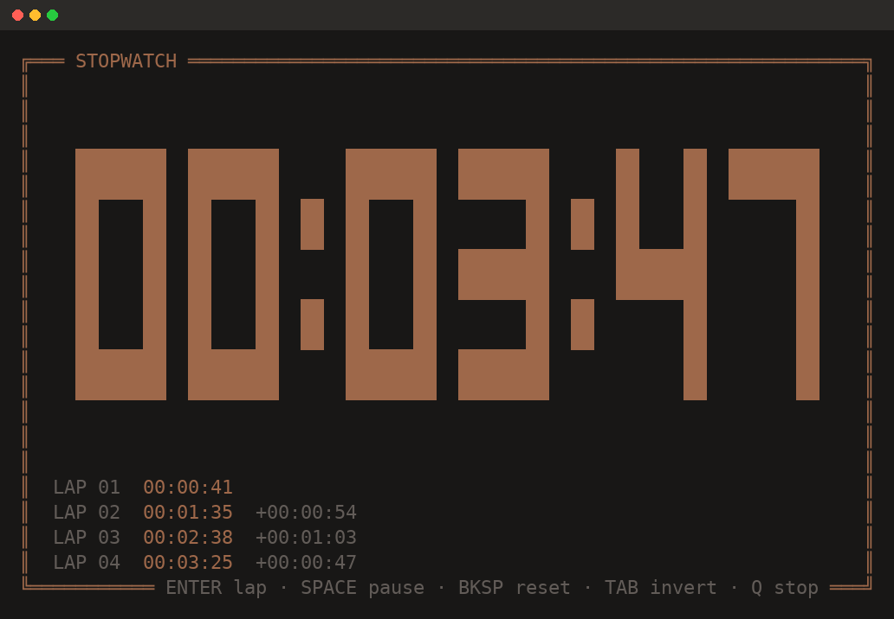
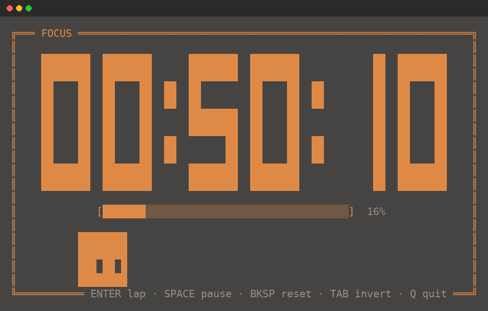

# cli-timer

A full-screen countdown timer and stopwatch for your terminal, rendered in a
solid seven-segment font with a warm ember palette.



## Install

Requires [Node.js](https://nodejs.org) 14 or newer. No build step, no
dependencies.

```bash
npm install -g github:808kalli/cli-timer
```

`cyber-timer` is now available as a command in any terminal. To upgrade, run
the same command again; to remove it, `npm uninstall -g cyber-timer`.

Prefer not to install it permanently? Run it on demand:

```bash
npx github:808kalli/cli-timer 25
```

## Usage

```bash
cyber-timer <duration> [options]   # countdown
cyber-timer stopwatch [options]    # count up (alias: sw)
```

### Countdown

Pass a duration in whichever format is most natural:

| Input     | Meaning            |
| --------- | ------------------ |
| `25`      | 25 minutes         |
| `25m`     | 25 minutes         |
| `90s`     | 90 seconds         |
| `1h30m`   | 1 hour 30 minutes  |
| `10:00`   | mm:ss              |
| `1:10:00` | hh:mm:ss           |

A progress bar tracks how much of the duration has elapsed. When it reaches
zero the display shifts to the alert color, the terminal beeps three times, and
it waits for a keypress so a finished timer never disappears unnoticed.



### Stopwatch

```bash
cyber-timer stopwatch
```

Counts up from zero with no upper bound. Press `Enter` to record laps, which
are listed in the bottom-left with the split from the previous lap.



The six most recent laps stay on screen, and the digits shrink to make room
rather than being pushed off-center. The **full** list is printed to your
terminal on exit, so nothing is lost when the display closes:

```
Stopped — elapsed 00:03:47
  LAP 01  00:00:41
  LAP 02  00:01:35  +00:00:54
  LAP 03  00:02:38  +00:01:03
  LAP 04  00:03:25  +00:00:47
```

### The slime

A small slime wanders along the floor of the box while the timer runs. It is
built from the same tiles as the digits, and its two eyes are simply left
unpainted so the background shows through them.

```
  ████████    ████████    ████████    ████████
  ████████    ███ ██ █    █ ██ ███    ████████
  ██ ██ ██    ████████    ████████    ████████
  ████████    ████████    ████████    ████████
    ahead     glancing    glancing      eyes
               right         left       shut
```

It mostly sits still, then crosses the floor in one purposeful trip — never
less than a quarter of the width — and settles again. Every so often it
glances up at the clock, shifting its eyes a tile up and a tile toward the
middle, and holds that look for one to four blinks spaced three to four
seconds apart before facing front again.

Its eyes never swing across while shut. The direction is fixed for the whole
of a blink and can only change at the moment the eyes reopen, so if it crossed
the middle of the terminal during a glance, the next blink hides the switch
and it reopens looking the other way. While the timer is paused it stays put
with its eyes shut. Hide it with `--no-slime`.

### Themes

`Tab` flips between the default theme — muted ember drawn straight onto your
terminal background — and a dark grey panel carrying a brighter amber. Start in
the flipped theme with `--invert`.



## Keys

| Key         | Action                                             |
| ----------- | -------------------------------------------------- |
| `Enter`     | record a lap (listed bottom-left, printed on exit) |
| `Space`     | pause / resume                                     |
| `Backspace` | reset and clear laps                               |
| `Tab`       | flip between the default and panel theme           |
| `q`         | quit                                               |
| `Ctrl+C`    | quit                                               |

Pausing works in both modes and freezes the clock outright — a countdown
paused for a minute still has the same time left when you resume.

Backspace sends the stopwatch back to `00:00:00` and a countdown back to its
full duration, clearing any recorded laps along with it. The reset laps are
gone for good, so they will not appear in the summary printed on exit.

Quitting early prints how much time was left (countdown) or how long it ran
(stopwatch).

## Options

| Flag                 | Description                                                  |
| -------------------- | ------------------------------------------------------------ |
| `-t, --title <text>` | label in the title bar (default `CYBER TIMER` / `STOPWATCH`)  |
| `-s, --silent`       | disable the completion beep (countdown only)                  |
| `-i, --invert`       | start in the flipped panel theme                              |
| `--no-slime`         | hide the hopping slime                                        |
| `-h, --help`         | show help                                                     |

```bash
cyber-timer 25
cyber-timer 90s --title "BREAK"
cyber-timer 1h --silent
cyber-timer 45m --invert
cyber-timer stopwatch
cyber-timer sw --title "LAP"
```

## Notes

- The time is always shown as `hh:mm:ss`, so the hours field stays visible at
  `00` and the readout never changes width as it crosses an hour.
- The display fills the terminal and re-lays out on resize. On terminals too
  narrow for the segment font it falls back to a plain readout rather than
  breaking the layout.
- Digits never grow taller than their width allows, so a tall but narrow
  terminal renders them at their natural proportions instead of stretching
  them into ribbons.
- Everything is drawn on the alternate screen buffer, so your scrollback is
  left untouched when the timer exits.

## Development

```bash
git clone git@github.com:808kalli/cli-timer.git
cd cli-timer
npm link        # makes `cyber-timer` available globally from this checkout
cyber-timer 5s
```

The renderer is pure — `lib/render.js` turns state into a string — so layout
can be inspected without a TTY:

```bash
node -e "console.log(require('./lib/render').renderFrame({
  cols: 80, rows: 24, title: 'TEST', mode: 'countdown',
  remainingSeconds: 1500, totalSeconds: 1500, finished: false, laps: []
}))"
```

## License

MIT
